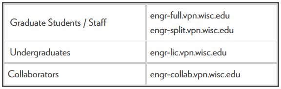

# Secure Shell (SSH) Setup for Remote Linux Connection

## Document info

| Last update | Author         | Notes or changes                    |
|-------------|----------------|-------------------------------------|
| 2022/02/11  | Steinbergs     | Initial creation                    |

## Cited Sources
* [Get started with OpenSSH](https://github.com/MicrosoftDocs/windowsserverdocs/blob/main/WindowsServerDocs/administration/OpenSSH/OpenSSH_Install_FirstUse.md)
* [Engineering VPN: PaloAlto GlobalConnect](https://kb.wisc.edu/cae/page.php?id=84859)


## Operating System(s) and requirements
* These instructions are based on Secure Shell connection for a Windows 10, 64-bit operating system. 
* This procedure assumes prior installation of [PaloAlto Global Connect VPN](https://kb.wisc.edu/cae/page.php?id=84859).
* Please note that the Graduate Students/Staff portal addresses are the only valid options for this procedure (undergradutes must request access).
    
    

## Purpose
Setup up a local machine to run a Secure Shell connection (terminal only) to the ERB 1338 Ubuntu Linux machine.

## Procedure

1. Run PowerShell as an Administrator.

2. Run the cmdlet `Get-WindowsCapability -Online | Where-Object Name -like 'OpenSSH*'` to check if OpenSSH is already isntalled.

3. The output should show `State : NotPresent` if the OpenSSH client is not already installed.

4. Run `Add-WindowsCapability -Online -Name OpenSSH.Client~~~~0.0.1.0` to install the OpenSSH client, the output should show:

```
Path          :
Online        : True
RestartNeeded : False
```

5. You can now connect to the Ubuntu Linux machine by running `ssh yourCAEusername@sel-ws01.me.wisc.edu` in PowerShell while connected to a valid GlobalProtect portal.

6. Following this initial call you will be asked if you are sure you want to connect. Run `yes` to add the server to the list of known SSH hosts on your Windows client.

7. Finally, you are prompted to enter you CAE password (NOTE: the entry is hidden as a security precaution). The output should be the following:

```
yourCAEusername@sel-ws01:~$
```

